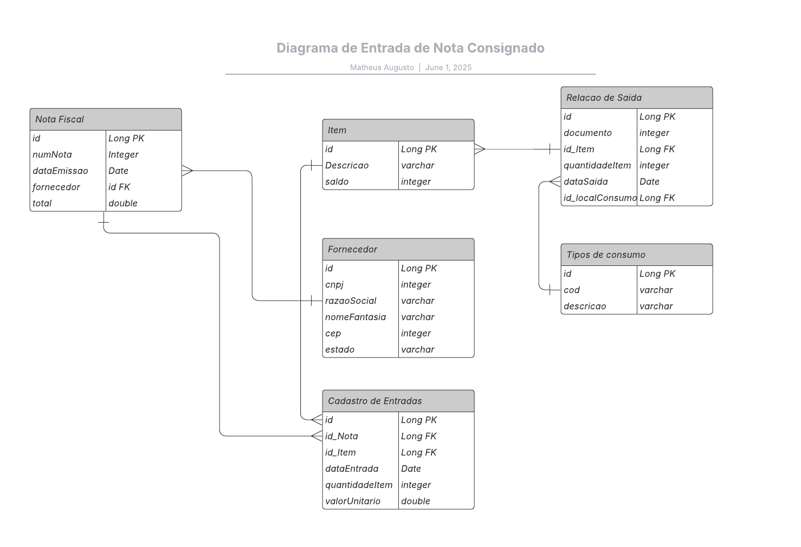

# PROJETO ENTRADA DE NOTAS

## Rotinas a serem executadas.

    1. Incluir Nota Fiscal
        1.1. Cadastrar nota
        1.2. Selecionar/Incluir Fornecedor
        1.3. Selecionar/Incluir Item

    2. Saida de item
        2.1. Registrar saida
    
    3. Cadastrar local de consumo

### Diagrama utilizado.

